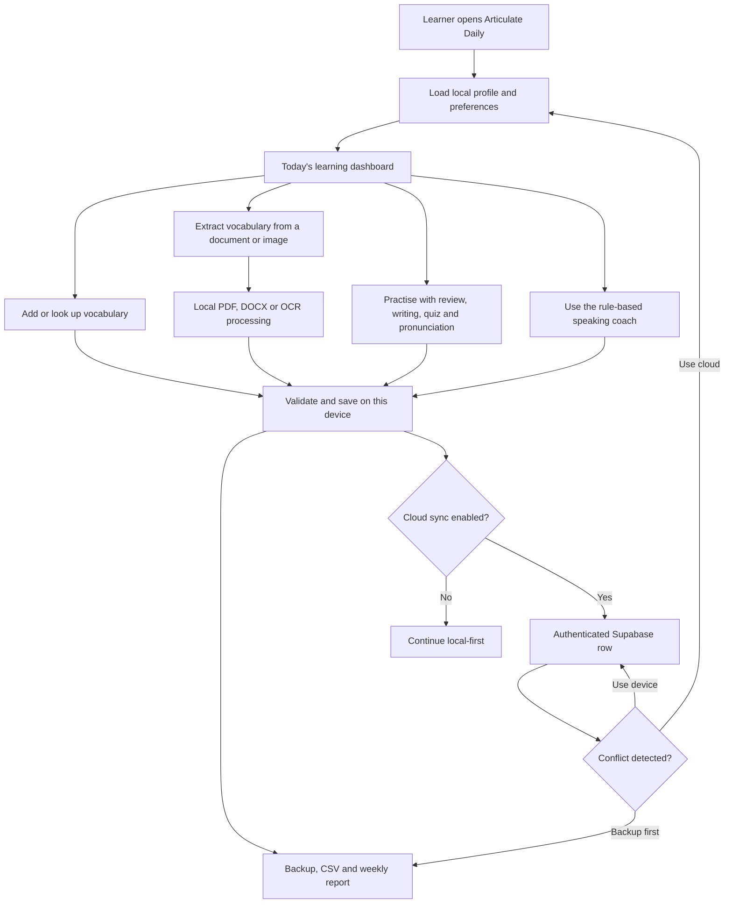

# Articulate Daily v3.03 — Architecture

Articulate Daily is a local-first English learning application. All essential learning functions work in the browser without an account. Users may optionally create an account to synchronise the same state through Supabase.

## Components

| Component | Responsibility | Availability |
|---|---|---|
| `index.html` | Complete application UI and local business logic | Always |
| `config.js` | Public optional backend configuration | Always; blank by default |
| `vendor/` | Locally bundled document, OCR and sync browser libraries | Loaded only when needed |
| Browser local storage | Profiles, words, progress and preferences | Default persistence |
| Supabase Auth | Optional email/password identity | Requires configured free project |
| `user_app_state` | One protected JSON state row per authenticated user | Optional cloud persistence |
| Dictionary API | Optional definition lookup | Requires internet |

## Security boundaries

- The browser receives only the Supabase anon/publishable key. A service-role key must never be placed in the project.
- Supabase row-level security restricts each data row to its authenticated user.
- Imports are size-limited, normalised and rendered with escaping.
- CSV exports neutralise spreadsheet formulas.
- Document processing is limited by file size, page count and text length.
- All destructive account-state operations require two-step confirmation.

## Data lifecycle

1. A new user receives a default local profile.
2. Every material change writes to local storage immediately.
3. If signed in, changes are debounced and uploaded to the user’s protected row.
4. A conflict asks the user to choose cloud, device, or backup-first.
5. Exported JSON remains the portable recovery format.
6. “Delete all app data” removes both cloud and local state when signed in.
